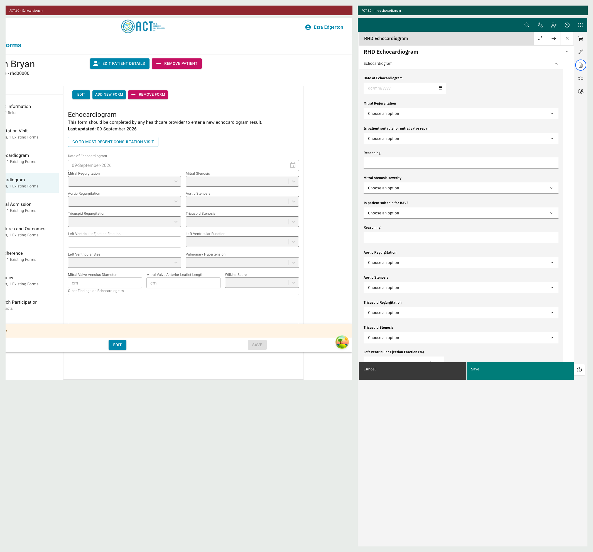
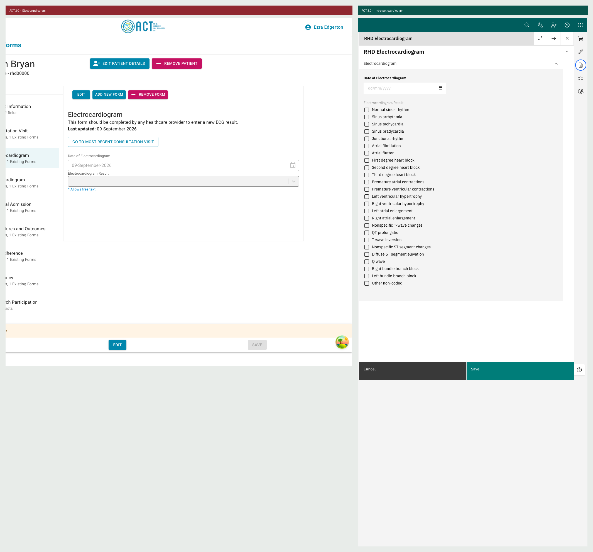
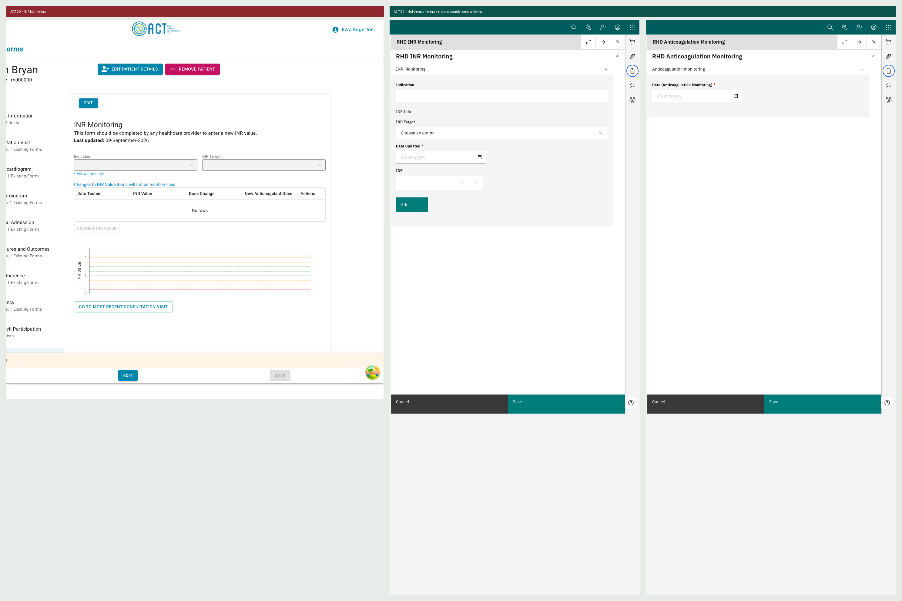
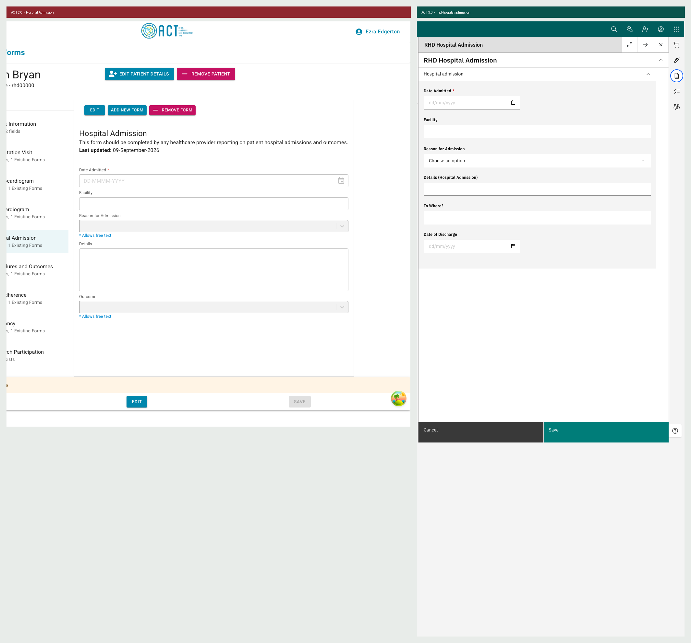
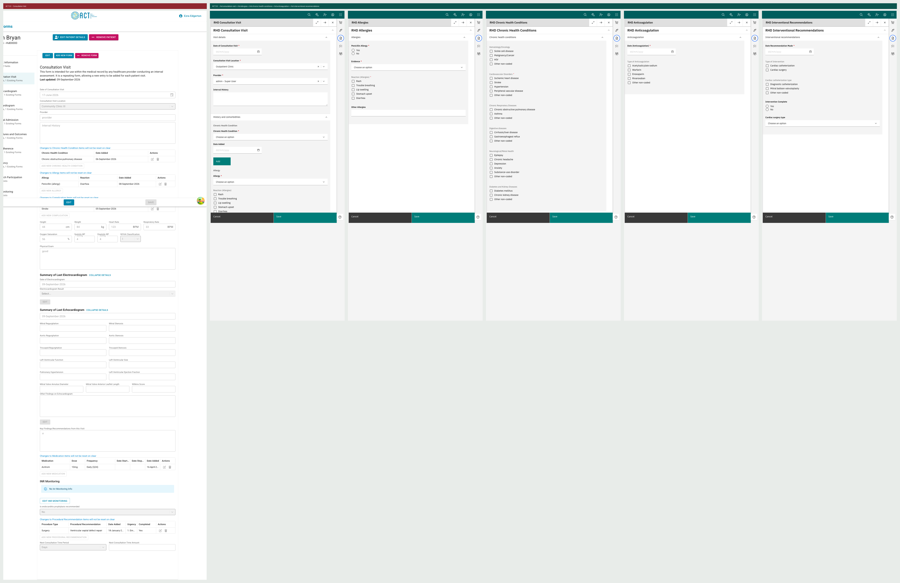
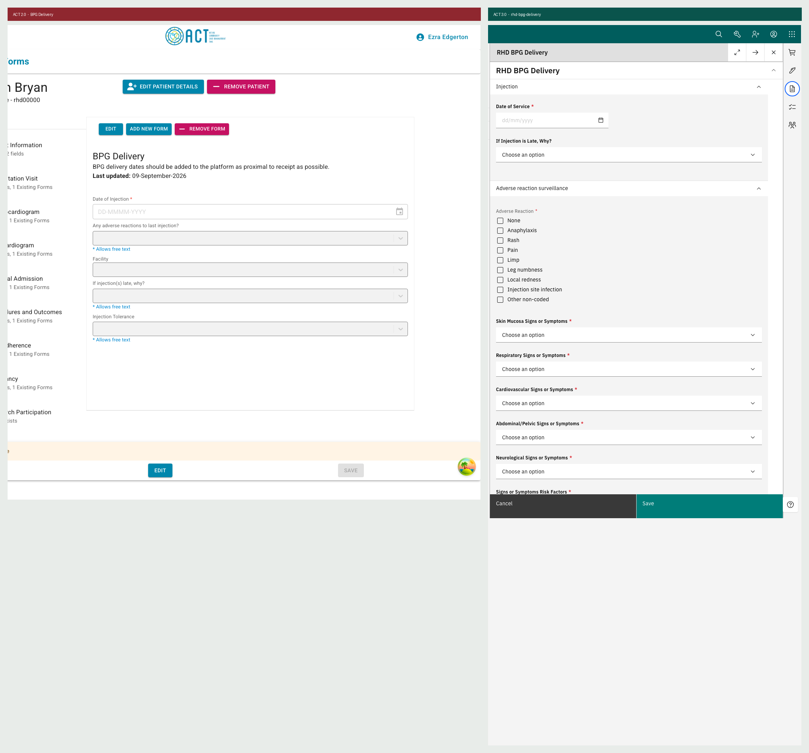
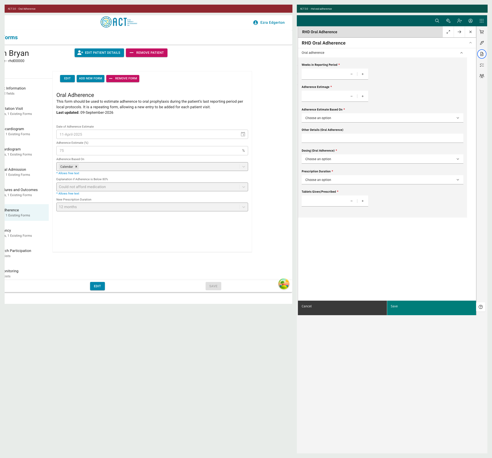
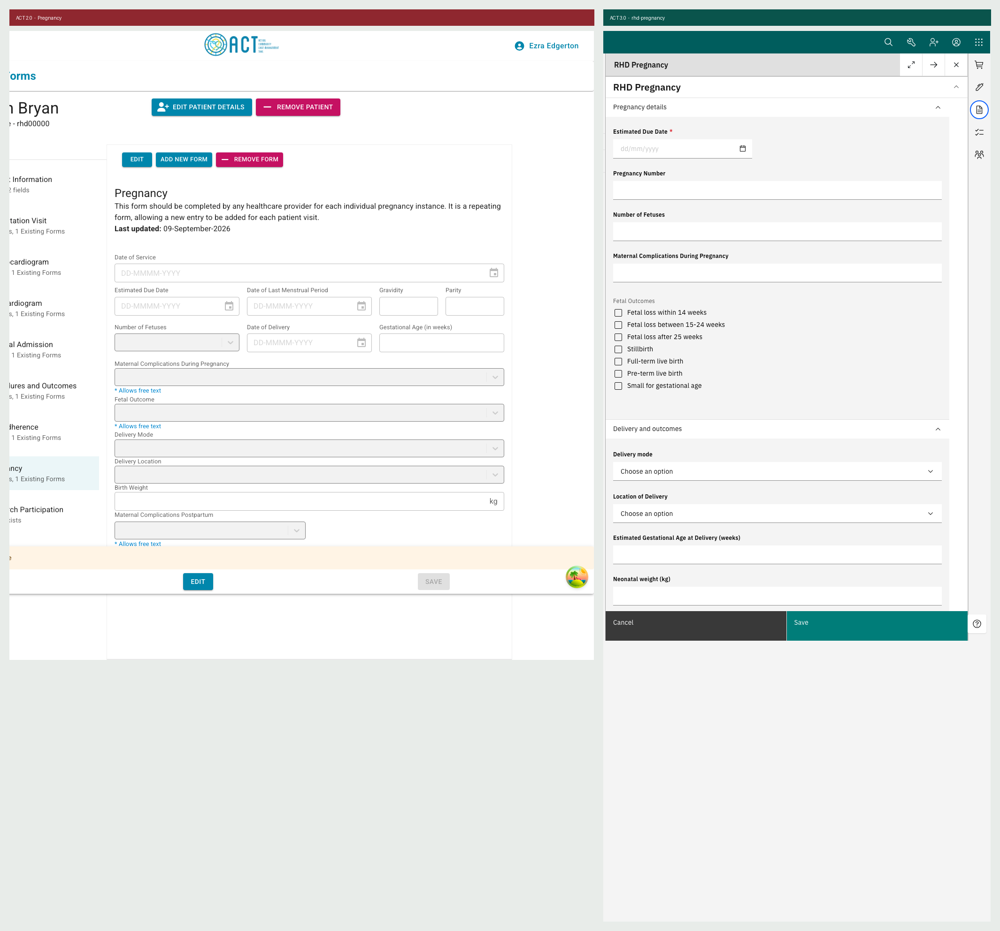
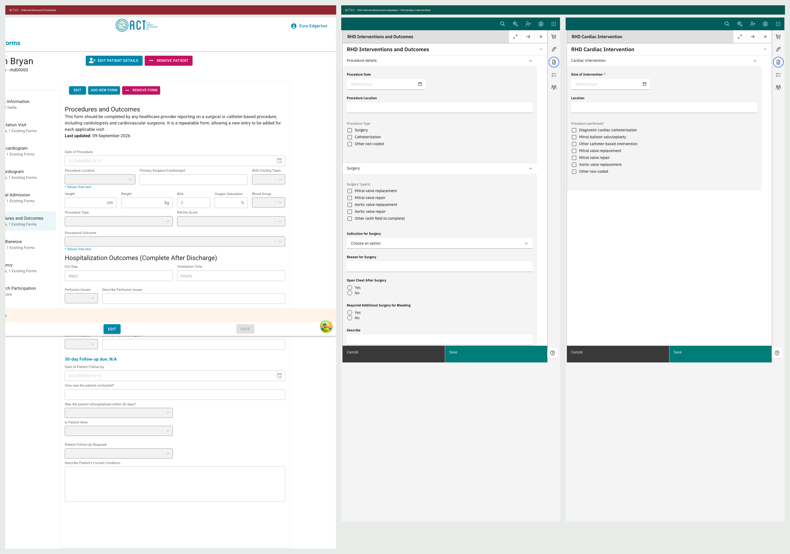
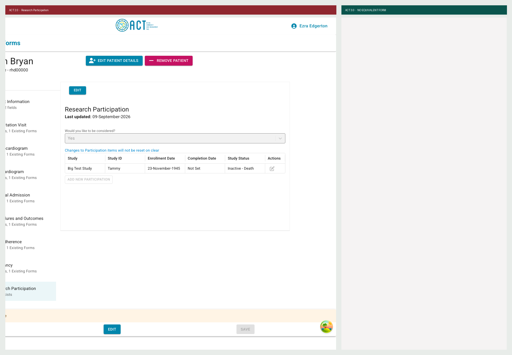

# ACT 2.0 to ACT 3.0 form parity

Form-by-form comparison of the ACT 2.0 registry against the 18 RHD forms in this distro,
both running locally and driven through their real UIs.

| | |
|---|---|
| ACT 2.0 | `is4r-rhd-cdk` + `is4r-rhd-ui`, local stack, patient `rhd00000` (all 10 form types populated) |
| ACT 3.0 | this distro at `407740b` plus the fixes on `fix/echo-mitral-repair-and-ecg-multiselect`, patient `rhd00001`, active visit |
| Captured | 11 September 2026 |

Screenshots are in `forms/`, one image per ACT 2.0 form, ACT 2.0 on the left and its ACT 3.0
counterpart(s) on the right.

## How this was checked, and two corrections

Field coverage was measured against the **18 form JSON schemas**, not the rendered page. Two
earlier methods gave false results and are recorded so nobody repeats them:

- **Exact label matching produced 64 false gaps.** Labels were legitimately renamed
  (`Mitral Stenosis` to `Mitral stenosis severity`), gained unit suffixes (`(cm)`, `(%)`), and
  unit fragments (`mmHg`, `cm`, `days`) were being read as fields.
- **Scraping rendered labels produced about 10 more.** The O3 form engine renders date pickers
  **without a `<label>` element**, so every `Date of ...` field looked absent. `Date of Echocardiogram`
  is in the schema and on screen, but invisible to a label scrape.

Net: 204 questions across 18 ACT 3.0 forms, against 109 ACT 2.0 fields.

## Summary

| ACT 2.0 form | Fields | Covered | Gaps | ACT 3.0 counterpart |
|---|---|---|---|---|
| Echocardiogram | 15 | 15 | **0** | RHD Echocardiogram |
| Electrocardiogram | 2 | 2 | **0** | RHD Electrocardiogram |
| INR Monitoring | 2 | 2 | **0** | RHD INR Monitoring + Anticoagulation Monitoring |
| Hospital Admission | 5 | 4 | **1** | RHD Hospital Admission |
| Consultation Visit | 33 | 31 | 2 renames | RHD Consultation Visit + 4 split-out forms |
| BPG Delivery | 5 | 2 | **2** | RHD BPG Delivery |
| Oral Adherence | 5 | 2 | **2** | RHD Oral Adherence |
| Pregnancy | 15 | 10 | **4** | RHD Pregnancy |
| Interventions and Outcomes | 26 | 17 | **8** | RHD Interventions and Outcomes + Cardiac Intervention |
| Research Participation | 1 | 0 | **1** | none |

**At least 18 ACT 2.0 fields have no home in any of the 18 schemas** (17 originally reported, plus Hospital Admission's Outcome, found later). Six others flagged by the audit turned
out to be renames and are fine.

## The forms are not a 1:1 mapping

ACT 2.0's single 65-field Consultation Visit has been **split** into five ACT 3.0 forms:
Consultation Visit, Allergies, Chronic Health Conditions, Anticoagulation, and Interventional
Recommendations. That is a sound decision for O3, where one form is one encounter. It does mean
parity has to be judged field by field rather than screen by screen.

`RHD Consultation Update` is new and has no ACT 2.0 source. It is a 3-question follow-up
appointment form, **not** the mini consultation the MVP specification asks for (S3).

---

## Form by form

### Echocardiogram — parity reached

15 of 15 fields covered, after the fix on this branch restored
`Is patient suitable for mitral valve repair` and its `Reasoning`, which had been retired as
"fabricated". They are real: ACT 2.0 renders them in `EchocardiogramForm.tsx` inside
`Collapse in={mitralRegurgitation != "None"}`, and `InterventionalRecommendationsDataGrid.tsx`
shows the value as the **"Suitable for Repair"** column on the procedural waitlist.

Improvements over ACT 2.0 worth keeping: Wilkins Score is coded 1 to 16 rather than free text,
and LVEF, annulus diameter and leaflet length are numeric with units in the label.

### Electrocardiogram — parity reached

2 of 2 fields covered. The fix on this branch changed `Electrocardiogram Result` from a single
`select` to `checkbox`, giving 25 selectable findings. ACT 2.0 renders this field with `isMulti`
and stores it `-|-` delimited, so a single select could only ever have captured one finding of
several and the migration would have had nowhere to put the rest.

ACT 2.0 also sets `isCreatable` here, so clinicians can type off-list values. The distro's
`Other non-coded` answer models that correctly.

### INR Monitoring — parity reached

2 of 2 covered, across RHD INR Monitoring and RHD Anticoagulation Monitoring. ACT 2.0 keeps one
INR record per patient with readings in a JSON array; the distro splits readings into their own
encounters, which is the better model and gives every reading a real date.

### Hospital Admission — 1 gap

**Corrected 11 September 2026.** Originally recorded as 5 of 5. It is 4 of 5: **Outcome** is missing.

The error was in the matcher, not the data. Because ACT 2.0's single consultation was split
across several ACT 3.0 forms, coverage was checked **globally across all 18 schemas**. ACT's
`Outcome` therefore matched `Surgery Outcome` in `rhd_interventions.json` and was counted as
covered, even though `rhd_hospital.json` has no outcome field of any kind.

Independently confirmed: `rhd_hospital.json` carries two `_specBranching` notes,
"If Outcome = Transfer to another facility" and "If Outcome = Discharge to home", both branching
on a field that is not in the form. Somebody knew it belonged there.

**Consequence for this audit: 17 gaps is a floor, not a ceiling.** Global matching can let a field
in the wrong form satisfy the check, so other gaps may be hidden the same way. Re-running the
audit per form pair rather than globally would tighten it.

### Consultation Visit — covered, via five forms

31 of 33 covered. The two flagged are renames, not gaps:
`Systolic BP` to `Systolic Blood Pressure (mmHg)`, `Diastolic BP` to `Diastolic Blood Pressure (mmHg)`.

**Not reproduced:** ACT 2.0's consultation embeds *Summary of Last Electrocardiogram*, *Summary of
Last Echocardiogram* and an *INR Monitoring* block inline, each with its own edit control. The O3
form engine renders one form as one encounter and cannot embed another form's latest result.
That is chart composition rather than form definition, and would need a separate widget.

### BPG Delivery — 2 gaps

Missing: **Date of Injection**, **Injection Tolerance**.

`Date of Injection` is the field the adherence calculation counts. Without it there is nothing to
compute days-covered from.

### Oral Adherence — 2 gaps

Missing: **Date of Adherence Estimate**, **Explanation if Adherence is Below 80%**.

Also a typo to fix: the distro label reads **"Adherence Estimage"**.

### Pregnancy — 4 gaps

Missing: **Date of Last Menstrual Period**, **Gravidity**, **Parity**, **Date of Delivery**.

Gravidity and parity are standard obstetric fields. Date of delivery also drives an ACT 2.0
critical flag: if 30 days pass after the estimated due date with no delivery date, the patient is
flagged.

### Interventions and Outcomes — 8 gaps, the worst affected

Missing: **Primary Surgeon/Cardiologist**, **With Visiting Team**, **BSA**, **Blood Group**,
**RACHs Score**, **Procedural Outcome**, **Was the patient rehospitalized within 30 days?**,
**Patient Follow-Up Required**.

**Procedural Outcome is the serious one.** Two ACT 2.0 critical flag rules depend on it: hospital
outcome fields become due when the outcome is in-hospital death or the discharge date has passed,
and a value of in-hospital death raises a patient-death flag. Without the field, neither rule can
be evaluated.

BSA is calculated in ACT 2.0 from height and weight (Haycock equation), so it may be intentional
to derive rather than store it.

### Research Participation — no equivalent

ACT 2.0 has a Research Participation form (opt-in plus a list of studies). There is no
corresponding form in the distro, although a `Research Participation` **program** and workflow do
exist in `programs/rhd_programs.csv`. Enrolment may be the intended mechanism, which would be the
better model, but the opt-in question itself currently has nowhere to go.

---

## Cross-cutting findings

**Conditional display is not implemented anywhere.** Several forms carry a `_specBranching` key,
which is a comment and not logic. ACT 2.0 hides the BAV pair behind mitral stenosis and the mitral
repair pair behind mitral regurgitation; in the distro both render unconditionally. This affects
more than the echo form and needs the form engine's `hide` expressions.

**Renames need a migration mapping.** Where a label or coded answer was renamed
(`RBBB` to `Right bundle branch block`, `Sinus rhythm` to `Normal sinus rhythm`, `Anamolous` corrected
to `Anomalous`), production data holds the old strings. Every rename needs an entry in the ETL map.

**Retirement by live inspection is unsafe.** Two echo concepts were retired with the note
"confirmed via live legacy app inspection this field does not exist". They do exist, inside a
conditional block that only renders when mitral regurgitation is set. Any other row retired on the
same evidence is worth re-checking.

## Suggested order of work

1. **Procedural Outcome** on Interventions and Outcomes. Blocks two critical-flag rules.
2. **Date of Injection** on BPG Delivery. Blocks adherence.
3. **Gravidity, Parity, LMP, Date of Delivery** on Pregnancy. Blocks the overdue-delivery flag.
4. The remaining Interventions and Outcomes fields.
5. Oral Adherence gaps, plus the "Adherence Estimage" typo.
6. Decide whether Research Participation is a form, a program enrolment, or both.
