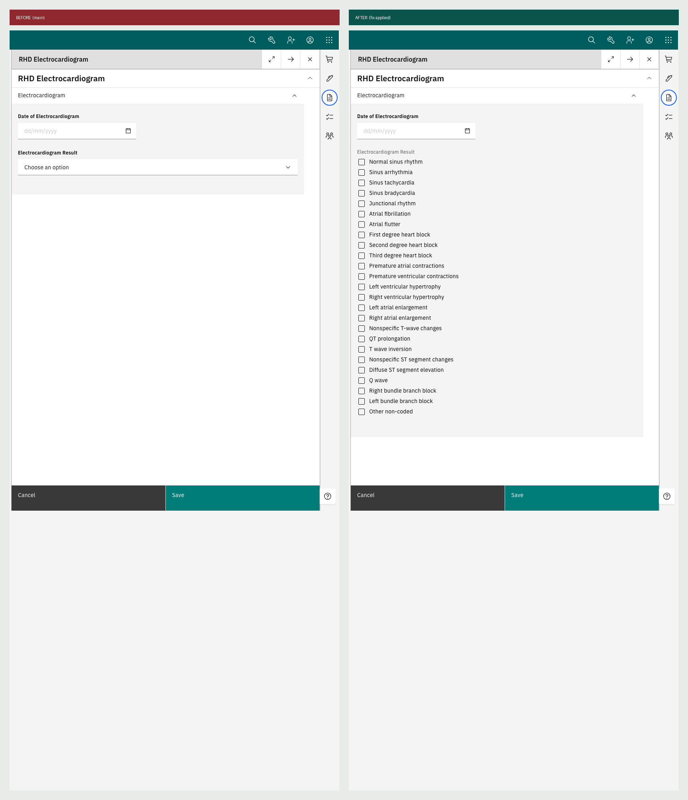
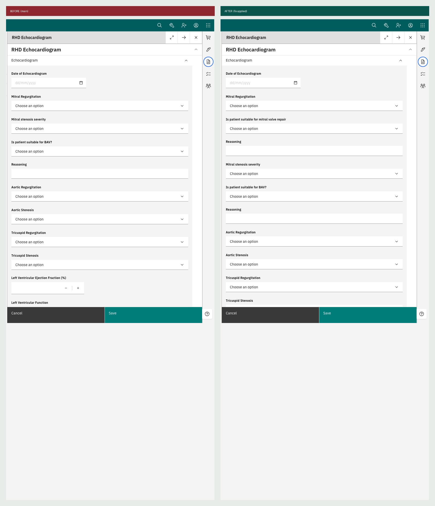

# Form defects found and fixed

Two defects in the RHD forms, both verified at runtime on the distro before and after the change.
Branch: `fix/echo-mitral-repair-and-ecg-multiselect`.

## 1. Electrocardiogram result was single-select, losing data



**Was:** `rendering: "select"` on `Electrocardiogram Result`, a single dropdown reading
"Choose an option".

**ACT 2.0:** the same field is a **multi-select**. From `ElectrocardiogramForm.tsx`:

```
line  87:  type: "multi-select"
line 271:  isCreatable
line 272:  isMulti
```

Values are stored as one string joined by `-|-` (`MULTI_DELIMITER` in `formHelpers.ts`), so one
field holds several findings. The same multi-select declaration appears again in the consultation
form's embedded ECG summary.

**Why it matters:** a patient routinely has more than one finding on a single ECG, for example
sinus rhythm together with left ventricular hypertrophy. A single select can capture one and
silently drops the rest, and migrating existing delimited values would have nowhere to put them.

**Fix:** `rendering: "checkbox"`, which is the convention already used 20 times elsewhere in this
distro for multi-select. Verified: 25 checkboxes render in the patient chart.

**Answer set note:** four values were deliberately renamed (`RBBB` to `Right bundle branch block`,
`LBBB` to `Left bundle branch block`, `Sinus rhythm` to `Normal sinus rhythm`,
`Third degree (complete) heart block` to `Third degree heart block`) and one added
(`Other non-coded`, which correctly models ACT 2.0's `isCreatable`). All sensible. They do need a
migration mapping, because production holds the old strings.

## 2. Two echocardiogram concepts were retired on a false negative



**Was:** `q_is_patient_suitable_for_mitral_valve_repair` and `q_reasoning_mitral_valve_repair`
marked `Void/Retire=true` in `concepts/rhd_questions_consultation.csv`, with the note:

> "fabricated -- confirmed via live legacy app inspection (2026-09-10) this field does not exist"

**It does exist.** In ACT 2.0 it appears in four places:

- `EchocardiogramForm.tsx` lines 533-560, a labelled FormGroup pair
- `EchocardiogramSummary.tsx`, inside the consultation's embedded echo block
- `InterventionalRecommendationsDataGrid.tsx`, as the **"Suitable for Repair"** column on the
  procedural waitlist
- `models.py`, as real columns on `EchocardiogramForm`

**Why the live inspection missed it.** Two parallel conditional blocks:

```jsx
<Collapse in={mitralRegurgitation != "None"}>  →  mitral valve repair suitability + reasoning
<Collapse in={mitralStenosis      != "None"}>  →  BAV suitability + reasoning
```

Identical pattern, different trigger. If the patient being viewed had no mitral regurgitation, the
block never rendered. The BAV pair was kept and this one retired, though both are hidden the same
way.

**Why it matters:** the strategic plan's data elements index lists Wilkins score as used for
"repair-vs-replace decisions". Dropping repair suitability leaves the score with nothing to feed,
and removes a column from the surgical waitlist.

**Fix:** un-retired both concepts, restored `Question/Coded` with CIEL Yes/No and `Question/Text`,
and added the two questions after Mitral Regurgitation to match ACT 2.0's ordering.

**Lesson worth generalising:** "I looked in the live app and it was not there" is unsafe evidence
when fields are conditionally rendered. Any other concept retired on that basis is worth
re-checking against the source.

## Verification method

Both fixes were confirmed on a running distro, not just in the schema:

1. Boot the distro on `main` with the fixes stashed
2. Log in, open patient `rhd00001`, active visit, launch each form from **Clinical forms**
3. Screenshot and record rendered controls = **before**
4. Apply the fixes, restart the backend so Initializer re-reads the bind-mounted config
5. Repeat the identical script = **after**

| | Before | After |
|---|---|---|
| ECG controls | `text:1, date:1` | `checkbox:25, text:1, date:1` |
| Echo labels | 16, mitral repair absent | 17, mitral repair present |

## Known limitation of both fixes

`_specBranching` is **a comment, not logic**. The O3 form engine ignores it, so the new mitral
repair pair and the existing BAV pair both render unconditionally, where ACT 2.0 hides them. No
form in this distro implements conditional display yet. Making that work needs the form engine's
`hide` expressions and affects more forms than these two.
