# Form-by-form sign-off, ACT 3.0 against ACT 2.0

Every RHD form opened on a running distro, one at a time, and compared against its ACT 2.0
counterpart in source.

| | |
|---|---|
| ACT 3.0 | `fix/echo-mitral-repair-and-ecg-multiselect` at `f008b869` **plus uncommitted parity work** |
| ACT 2.0 | `is4r-rhd-ui`, all 12 form components read from source |
| Instance | clean `docker compose down -v` then `up`, database wiped, metadata loaded from scratch |
| Captured | 14 September 2026 |

**All 18 forms open. Zero JavaScript errors across all 18.**

## Summary

| ACT 3.0 form | fields | conditions | required | ACT 2.0 | verdict |
|---|---|---|---|---|---|
| rhd_adherence | 8 | 2 | 0 | OralAdherenceForm (5) | complete |
| rhd_bpg | 13 | 8 | 1 | BPGDeliveryForm (11) | complete |
| rhd_consent | 8 | 0 | 0 | ResearchParticipationForm (1) | complete |
| rhd_consultation | 48 | 41 | 1 | ConsultationVisitForm (21) | complete, see note |
| rhd_echocardiogram | 19 | 5 | 0 | EchocardiogramForm (19) | complete |
| rhd_electrocardiogram | 3 | 1 | 0 | ElectrocardiogramForm (2) | complete |
| rhd_hospital | 7 | 2 | 1 | HospitalAdmissionForms (7) | complete |
| rhd_inr_monitoring | 5 | 0 | 1 | InrMonitoringForm (3) | complete |
| rhd_interventions | 54 | 36 | 0 | InterventionsAndOutcomesForms (45) | complete |
| rhd_patient_information | 13 | 4 | 0 | PatientInformationForm (23) | complete, see note |
| rhd_pregnancy | 19 | 7 | 1 | PregnancyForm (22) | complete |
| rhd_allergies | 4 | 1 | 0 | none | ACT 3.0 only |
| rhd_anticoagulation | 2 | 0 | 1 | none | ACT 3.0 only |
| rhd_anticoagulation_monitoring | 1 | 0 | 1 | none | ACT 3.0 only |
| rhd_cardiac_intervention | 3 | 0 | 1 | none | ACT 3.0 only |
| rhd_chronic_conditions | 6 | 0 | 0 | none | ACT 3.0 only |
| rhd_consultation_update | 2 | 1 | 0 | none | ACT 3.0 only |
| rhd_recommendations | 5 | 3 | 1 | none | ACT 3.0 only |

ACT 2.0 field counts are lower because its Consultation Visit and Patient Information forms
carry fields that ACT 3.0 places elsewhere: registration, the program workflow, or one of the
seven ACT 3.0-only forms which decompose ACT 2.0's monolithic consultation.

## What changed to get here

**Fields added: 34**, across five forms, each with its ACT 2.0 condition wired.

| Form | Added |
|---|---|
| rhd_interventions | 19: surgical detail, post-procedure findings, death, 30-day rehospitalisation, follow-up |
| rhd_pregnancy | 6: Last Menstrual Period (CIEL 1427), Gravidity, Parity, Reason for Cesarean, two detail fields |
| rhd_bpg | 4: Facility, Injection Tolerance, Describe Anaphylaxis Events, Time Between Injection and Symptom Onset |
| rhd_patient_information | 3: Date Diagnosed (CIEL 159948), Primary Diagnosis Details, School Name |
| rhd_consultation, rhd_adherence, rhd_consent | 1 each |

**Concepts added: 29.** CIEL reused where the loaded subset has a usable question concept
(1427 Last Menstrual Period, 159948 Diagnosis date, 159 Deceased); local ACT-RHD concepts
otherwise, since CIEL's loaded subset has no discharge-disposition, parity, RACHS or
cardiopulmonary-bypass question.

**Deviations corrected**

| Deviation | Was | Now |
|---|---|---|
| `required` flags | 38 across 13 forms | 9, all date fields. ACT 2.0 marks 2 |
| `Date of Death` mandatory and always visible | form unsaveable for a living patient | gated on `patient.deceased*`, not required |
| Adverse Reaction answer wording | `Pain`, `Rash`, `Leg numbness` | ACT 2.0 wording with the `>48 hours` qualifiers, `Leg swelling` |
| Anaphylaxis trigger | Adverse Reaction only | either Adverse Reaction or Injection Tolerance, as ACT 2.0 |
| School Name | always visible | gated on Case Detected By = School health screening |
| Patient Information layout | one flat list | Diagnosis / Contact and location / Death |
| `Tertiary Phone Ownder` | typo in concept and label | `Tertiary Phone Owner` |

## Form by form

ACT 2.0 on the left, ACT 3.0 on the right, both from running systems. ACT 2.0 panels are the
captures in `screenshots/act2-source/`; ACT 3.0 panels are fresh against this branch.

### BPG Delivery

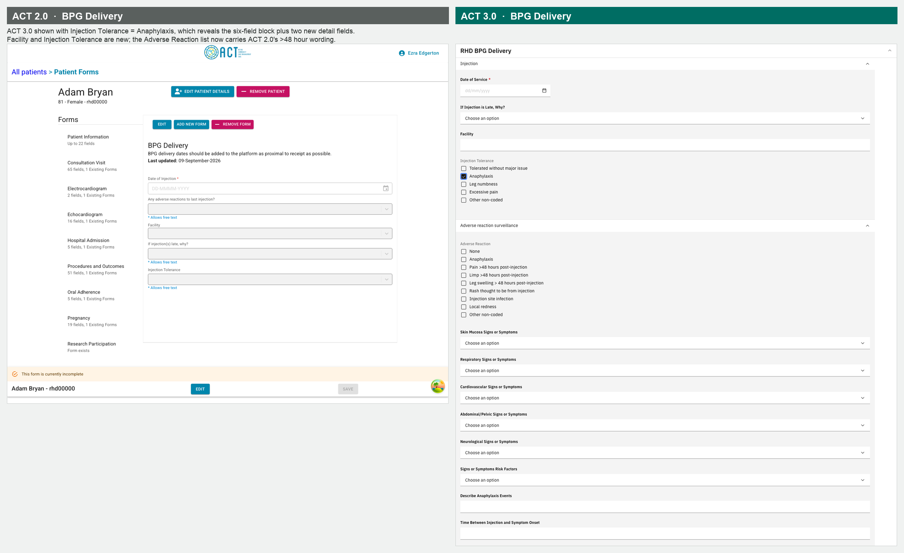

The most consequential fix in the set. ACT 2.0 reveals the six anaphylaxis fields when
**either** Adverse Reaction **or** Injection Tolerance contains Anaphylaxis. Injection
Tolerance did not exist in ACT 3.0, so one of the two documented triggers could not be
recorded at all.

**Decisions**

- **Injection Tolerance added** with ACT 2.0's five options. Anaphylaxis is deliberately left
  on Adverse Reaction as well, even though ACT 2.0 has it only on tolerance. Removing it broke
  the trigger PR #3 shipped, so a superset is safer than strict parity.
- **Facility added**, reusing the existing `Facility` concept rather than minting one.
- **Adverse Reaction wording restored** to ACT 2.0: `Pain >48 hours post-injection`,
  `Limp >48 hours post-injection`, `Leg swelling > 48 hours post-injection`,
  `Rash thought to be from injection`. The distro had generic `Pain` and `Rash` from CIEL and
  `Leg numbness`, which is an Injection Tolerance option, not an adverse reaction. The
  `>48 hours` threshold is the question, so dropping it changed the meaning.
- **Two detail fields added**: Describe Anaphylaxis Events, Time Between Injection and Symptom Onset.

**Conditions**: eight, all on the anaphylaxis block, each
`!(includes(adverse_reaction, ANAPH) || includes(injection_tolerance, ANAPH))`. Checkbox
triggers hold arrays, so they need `includes()` rather than `!==`.

### Interventions and Outcomes

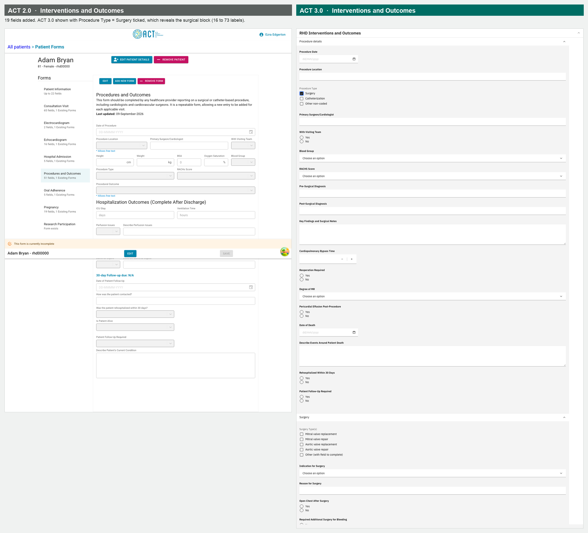

Was the largest gap: 19 missing fields covering the whole operative and 30-day record.

**Decisions**

- Surgical detail is gated on `Procedure Type = Surgery`, matching ACT 2.0.
- Reoperation reason gated on Reoperation Required, rehospitalisation detail on the 30-day
  question, Follow-Up Arranged on Follow-Up Required. Each condition ships with its field.
- **Blood Group, RACHS Score and Degree of MR need clinical sign-off.** Blood Group uses the
  eight standard groups, RACHS the published 1 to 6 scale, Degree of MR reuses the existing
  None / Mild / Moderate / Severe set.

**Conditions**: 36. Screenshot shows Surgery ticked, taking the form from 16 to 73 labels.

### Hospital Admission

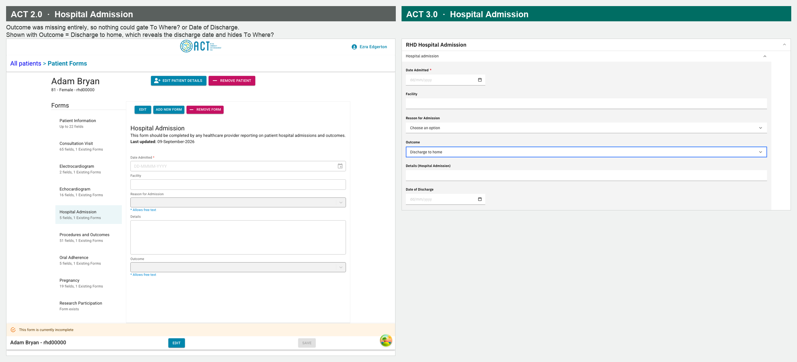

`Outcome` was missing entirely, so neither To Where? nor Date of Discharge could be gated on
anything. ACT 2.0 has it.

**Decisions**

- Outcome added with four answers. The Deceased answer reuses **CIEL 159** rather than the
  custom `ACT-RHD:death`, following the reuse audit already in this repo. CIEL's loaded subset
  has no discharge-disposition question, so the question concept stays local.
- `Transfer to another department` was the only answer needing a new concept.

**Conditions**: To Where? shows for either transfer option; Date of Discharge for discharge
to home. Screenshot shows Discharge to home, so the date is present and To Where? is not.

### Patient Information

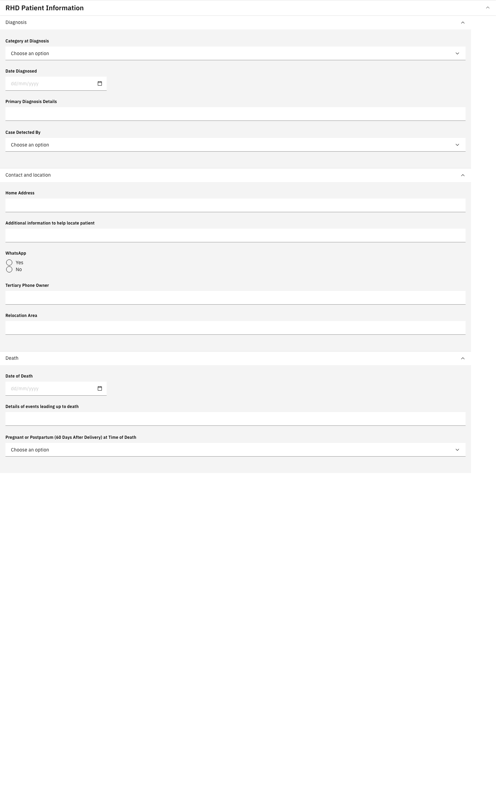

No ACT 2.0 capture exists for this form, so it is shown alone.

This form had the worst defect found: **Date of Death was mandatory and always visible**, so
the form could not be saved for a living patient. It returned `Field is mandatory`. ACT 2.0
marks nothing on this form required and wraps the death fields in
`Collapse in={reasonInactive == "Death"}`.

**Decisions**

- **Restructured into three sections**: Diagnosis, Contact and location, Death. It was one
  flat list with diagnosis fields split across it and Relocation Area orphaned in the middle.
- **Death block gated on `patient.deceasedDateTime`/`deceasedBoolean`.** ACT 2.0 gates on
  Reason Inactive = Death, which lives in the RHD Registry program workflow and cannot be read
  from a form expression. The person record is the platform-native equivalent. Verified both
  ways: hidden for a living patient, shown for a deceased one.
- **School Name gated** on Case Detected By = School health screening, as ACT 2.0 does.
- Three `required` flags dropped; `Tertiary Phone Ownder` corrected to `Owner`.
- **Not added**: Cardiac Clinic and Primary Care Clinic are location references, District of
  Residence belongs to the address hierarchy, and name, sex and identifiers belong to
  registration. Forcing patient-level data into observations is what made Category at
  Diagnosis unreachable from the consultation form.

### Pregnancy

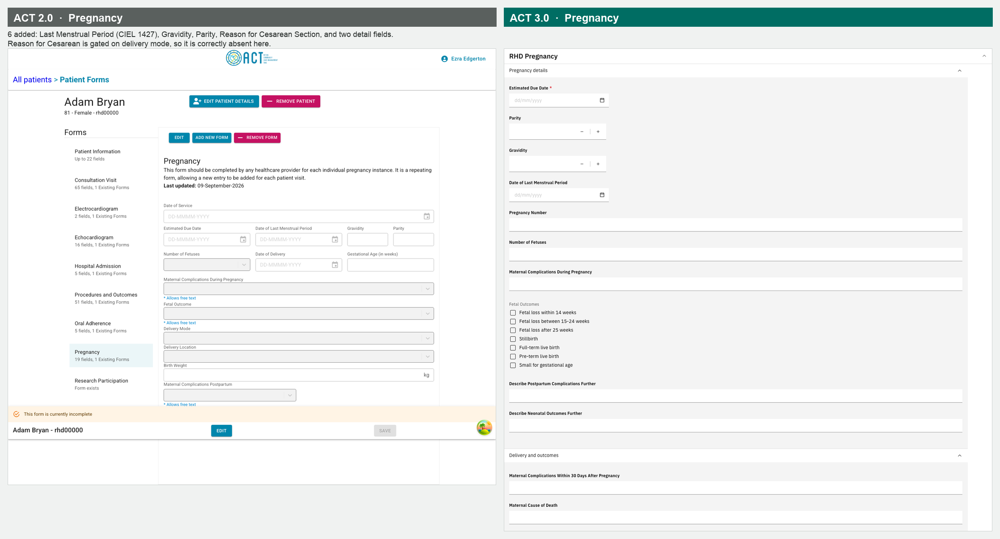

**Decisions**

- Last Menstrual Period reuses **CIEL 1427** rather than a local concept.
- Gravidity and Parity are local: CIEL's loaded subset has no usable question concept for
  either.
- Reason for Cesarean Section is gated on delivery mode, so it is correctly absent in the
  screenshot.
- Maternal Cause of Death is **not** gated, although ACT 2.0 gates it on postpartum
  complications containing Death. This distro models that field as free **text**, so there is
  no value to test. Fixing it means changing the field to coded, which is form-content work.

### Echocardiogram

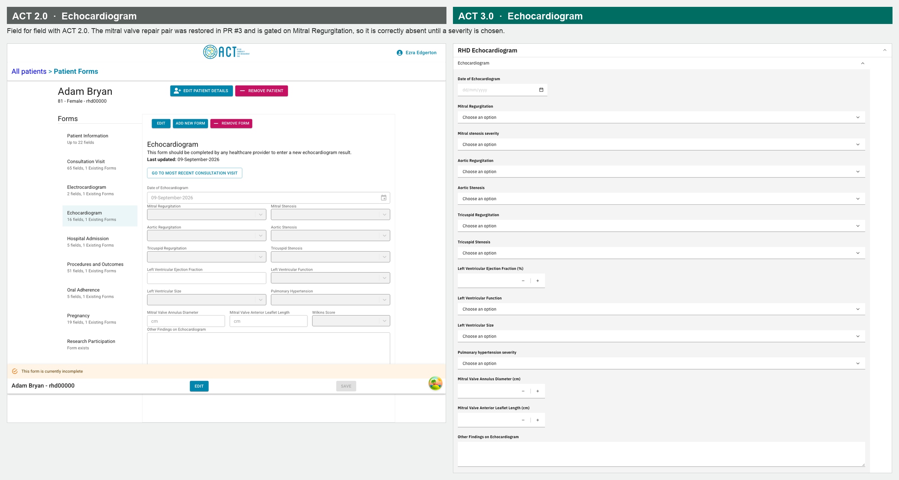

Field for field with ACT 2.0. The mitral valve repair pair was restored in PR #3 after being
retired as "fabricated"; it exists in ACT 2.0 behind `Collapse in={mitralRegurgitation != "None"}`,
which is why an inspection of the live app missed it. Gated on Mitral Regurgitation, so
correctly absent until a severity is chosen.

### Electrocardiogram

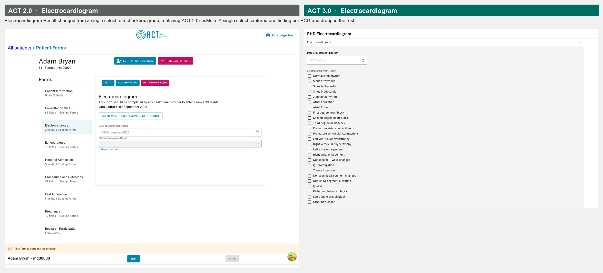

Electrocardiogram Result was a single `select` where ACT 2.0 declares `isMulti` and stores
values joined by `-|-`. A patient routinely has several findings on one ECG, so a single
select captured one and silently dropped the rest. Changed to `checkbox`.

### Oral Adherence

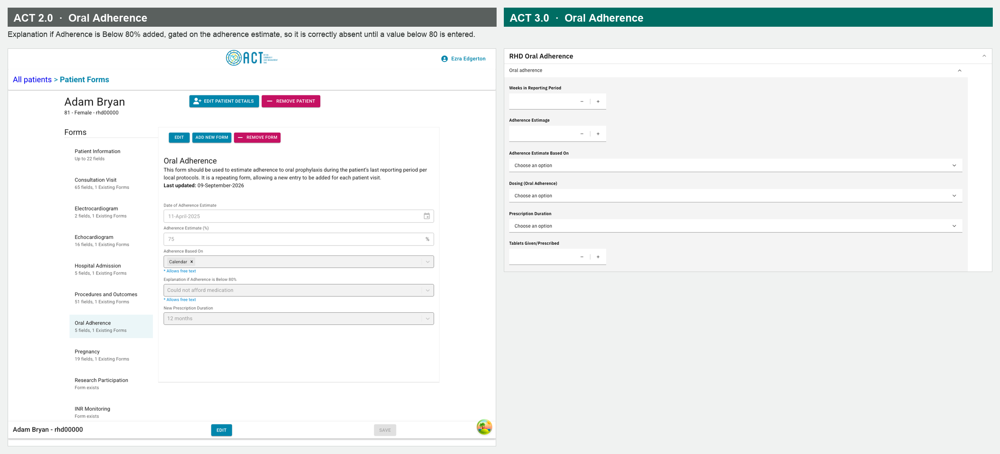

Explanation if Adherence is Below 80% added, gated on
`isEmpty(adherence_estimage) || adherence_estimage >= 80`. Correctly absent in the screenshot.
Six `required` flags dropped here, which were blocking partial entry.

### Consent and research participation

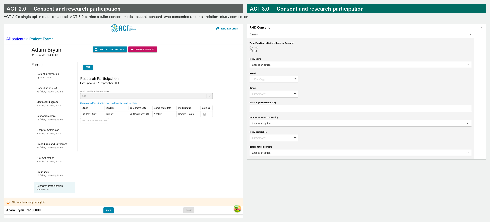

ACT 2.0's `ResearchParticipationForm` has exactly one field, the opt-in question, which was
missing and is now added. ACT 3.0 carries a fuller consent model around it.

### INR Monitoring

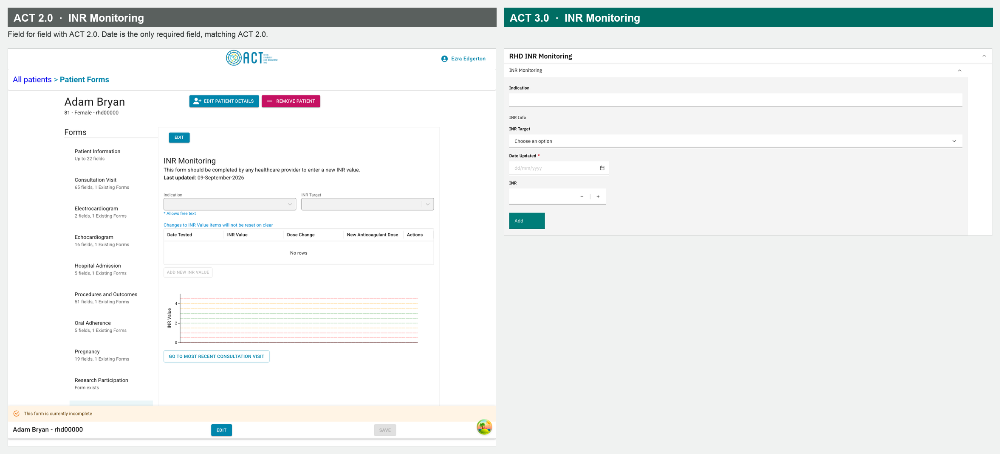

Field for field with ACT 2.0. Date is the only required field, matching ACT 2.0.

### Consultation Visit

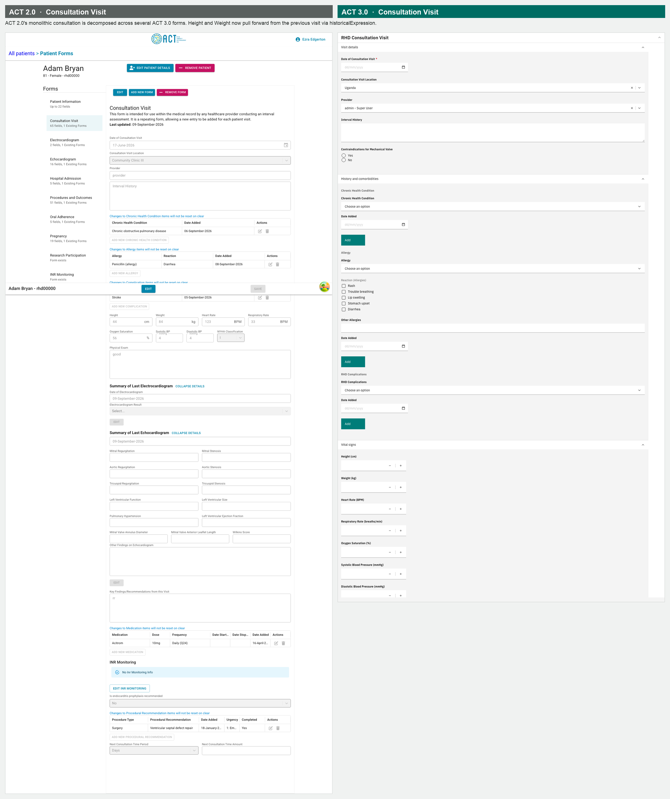

ACT 2.0's monolithic consultation is decomposed across several ACT 3.0 forms, which is why
the field counts do not line up. Height and Weight now pull forward from the previous visit
using `historicalExpression`, which is what their notes asked for and not a hide rule.
Contraindications for Mechanical Valve added.

**Caveat**: 40 of this form's 41 conditions are **answer-level** hides inside the
`interventionalRecommendationEntry` repeat group, and those do not re-evaluate per row. See
the known issue below.

## Known issues, not fixed here

**Answer-level conditions do not re-evaluate in "add more" groups.** In `rhd_consultation`,
the Interventional Recommendation options are filtered by `procedureType`. Row 1 works; row 2
is computed once when the row is created and never updates:

| Step | Row 1 options | Row 2 options |
|---|---|---|
| Row 1 = Surgery | 23, correct | |
| Add row 2, set Catheterization | 23 | 23, should be 19 |
| Flip row 1 to Catheterization | 19, correct | 23, still frozen |

Field-level conditions in the same group are unaffected. This looks like a form engine
limitation rather than a metadata error.

**The pregnancy form is offered for male patients.** Not a regression: ACT 2.0 lists forms
from a fixed array with no sex filter, and `esm-patient-forms-app` exposes no patient-dependent
filtering. The form engine gates fields, not forms.

**`Home Address` is a free-text obs.** It belongs on the person record. The distro has a
143,450-entry address hierarchy loaded, but it is not driving type-ahead on registration
either, so both halves need attention. Left alone: moving it is a data-migration question.

**Encounter types.** `rhd_patient_information` and `rhd_consent` both write to
`RHD Consultation Visit`, so demographics and consent are recorded against a clinical
consultation and re-recorded per visit. A modelling change, not a form edit.

**Pre-existing dangling concept.** `006ab3b2-a0ea-45bf-b495-83e06f26f87a`, referenced by
`rhd_consultation`, does not resolve on a clean database. Not introduced by this work.

## Answer sets wanting clinical sign-off

Chosen on defensible grounds, but wrong coded data looks correct:

- **Blood Group**: A+, A-, B+, B-, AB+, AB-, O+, O-
- **RACHS Score**: categories 1 to 6, the published RACHS-1 scale
- **Degree of MR**: reuses the existing None / Mild / Moderate / Severe severity set

## Verification performed

| Check | Result |
|---|---|
| All 18 forms open, JS errors | 18 open, 0 errors |
| Schema validation against json.openmrs.org/form.schema.json | 0 errors |
| `_specBranching` keys remaining | 0 |
| Concept references resolving | all, except one pre-existing |
| Duplicate concept names on a clean load | 0 |
| PR #3 acceptance suite | 13/13 |
| New-field suite | 18/18 |
| Patient Information saves for a living patient | yes, encounter confirmed |
