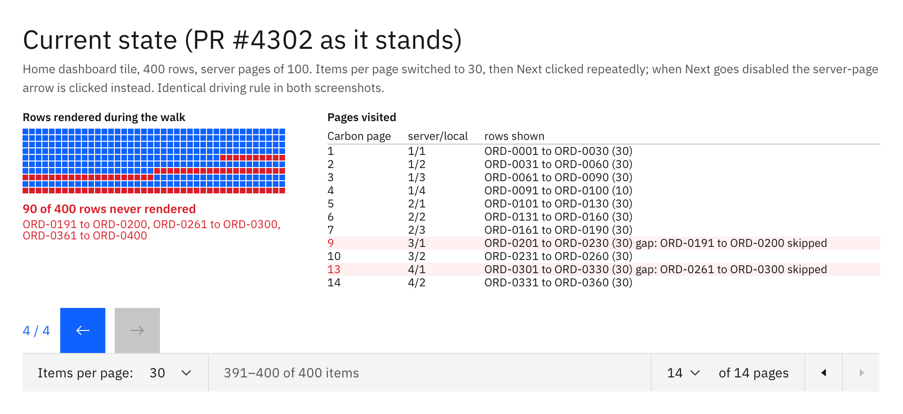
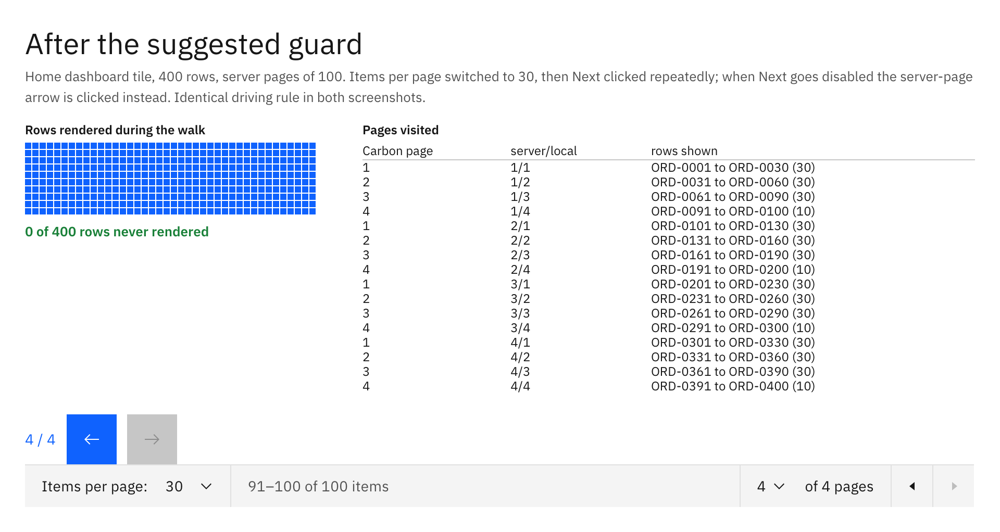

# OpenELIS PR #4302: page size 30 skips rows

Review evidence for [DIGI-UW/OpenELIS-Global-2#4302](https://github.com/DIGI-UW/OpenELIS-Global-2/pull/4302),
"fix(home-dashboard): keep pagination next enabled when page size is 100", at head `27b13b3`.
One file changed, `frontend/src/components/home/Dashboard.tsx`.

Out of scope for the ACT 3.0 audit; filed here because the evidence is visual and needed somewhere
to live.

## What the PR is trying to do

The Home dashboard tile list stacks two paginations: the REST endpoint pages server-side, and a
Carbon `Pagination` pages the loaded page client-side. With items per page set to 100 the Carbon
control computed one page and disabled Next, so that control could not reach the rest of the list.
The PR makes Carbon's Next and Previous drive the server page: it infers the server page size from
any non-last response, extends `totalItems` across all server pages, and translates the requested
virtual page into a (server page, local page) pair.

## The defect

`handlePageChange` resolves the target server page from a **contiguous item index**:

```js
const itemStart = (requestedVirtualPage - 1) * requestedPageSize;
const requestedServerPage = Math.floor(itemStart / serverPageSize) + 1;
```

while `virtualPage` maps back using **fixed blocks**:

```js
const clientPagesPerServerPage = Math.max(1, Math.ceil(serverPageSize / pageSize));
const virtualPage = (parseInt(currentApiPage) - 1) * clientPagesPerServerPage + page;
```

The two models only agree when a server page divides evenly into client pages. Their drift per
server page is `clientPagesPerServerPage * pageSize - serverPageSize`, and once that accumulates
past one client page, forward navigation jumps over a page of rows.

A full server page here holds **100** rows, not 99. `PagingProperties` defaults
`org.openelisglobal.paging.results.pageSize` to 99, but `PatientDashboardPageHelper.createPages`
appends one more item after the counter reaches that value:

```java
if (resultCount >= SpringContext.getBean(PagingProperties.class).getResultsPageSize()) {
    createNewPage = true;
}
page.add(item);
resultCount++;
```

Of the offered `pageSizes={[10, 20, 30, 50, 100]}`, 30 is the only one that does not divide 100.

## Current state



400 rows, four server pages of 100, items per page switched to 30. Clicking Next walks Carbon pages
1 to 7, then jumps to 9, 10, then 13, 14. **90 of the 400 rows are never rendered**: ORD-0191 to
ORD-0200, ORD-0261 to ORD-0300, and ORD-0361 to ORD-0400.

Note the pagination bar in that screenshot reads "391-400 of 400 items" while the table's last
rendered row was ORD-0360. Nothing throws, so there is no signal to the user that rows went past
them. Before this change those rows were reachable: Carbon paged inside one server page, and the
arrow buttons moved between server pages.

## After the suggested guard



```js
// The two page mappings agree only when a server page splits evenly.
const useVirtualPaging =
  hasMoreServerPages && !isFilterNarrowing && serverPageSize % pageSize === 0;
```

Page sizes that do not divide the server page fall back to the previous per-server-page behaviour:
Carbon pages within the loaded 100 rows, the server arrow moves between them. All 400 rows are
reached. Page size 100, which is what the PR set out to fix, still divides evenly, so it keeps the
new cross-page behaviour.

The tradeoff is visible in the screenshot: at page size 30 the Carbon control no longer spans
server pages, it reads "of 4 pages" against 100 items. That is the pre-PR experience, not a
regression from it.

## How this was measured

Both screenshots come from the same driving rule, applied to the same 400-row dataset: click
Carbon's Next; when Next goes disabled, click the server-page arrow; stop when neither will move.
The only difference between the two runs is the one-line guard.

The pagination state and handlers were lifted verbatim from the PR head and mounted against the
real `@carbon/react` `Pagination` (1.104.1, the version the frontend resolves), with the REST call
replaced by a fixture that chunks 400 rows the way `createPages` does. Playwright drove the real
Carbon controls and recorded the rendered row range after each click settled.

Separately, the same arithmetic was stepped through for every offered page size against totals from
1 to 5000, at server page sizes of 100 and 51. Without the guard, 30 is the only page size that
loses rows at today's 100. With the guard, no page size skips or repeats a row at either server
page size.

## Not covered

This was not run against a live OpenELIS instance with 400 dashboard rows. What is reproduced is
the component's pagination state machine and the real Carbon widget, not the full page, the REST
layer, or the session-cached paging on the server.
